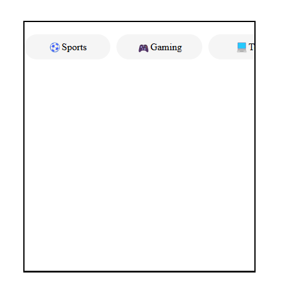

# Tab Bar - Material Auto-Scrolling Tabs

A clean and interactive material design for auto-scrolling tabs that dynamically scroll to the selected tab when clicked. This layout is optimized for mobile views, with a sleek and smooth scroll effect for seamless navigation.

## Demo
🌐 [Code Pen - Live Demo](https://codepen.io/yrlp98/pen/ogvNrOx)

## Features

- Mobile-optimized layout.
- Smooth auto-scrolling to selected tabs.
- Sleek material design with hover effects.
- Easy to customize and implement in your projects.

## Technologies Used

- HTML5
- CSS3 (Flexbox)
- Vanilla JavaScript
